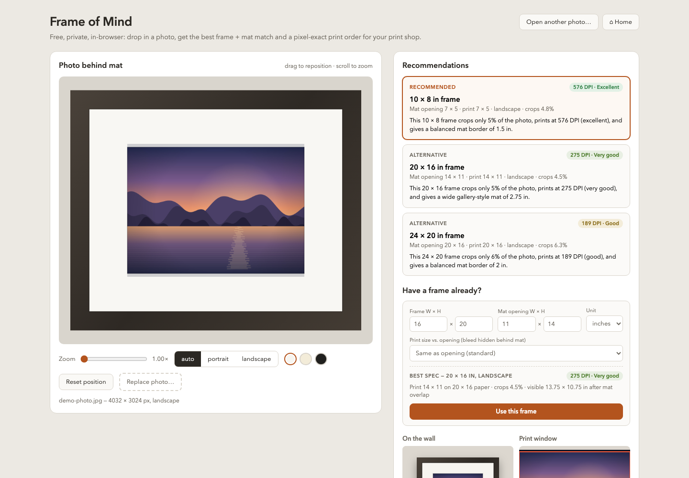
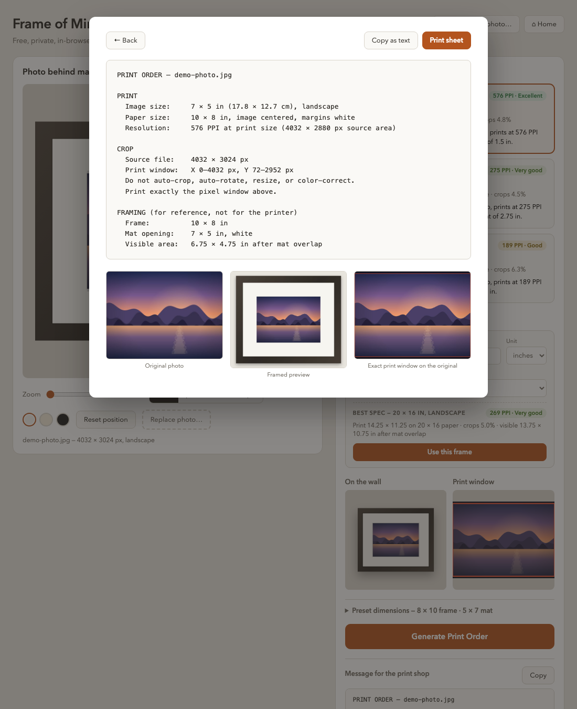

# Frame of Mind

A local web app that takes one photo and produces one deliverable: a precise,
unambiguous **printer instruction sheet** you send to your print shop.

Everything runs in the browser. No backend, no accounts, no uploads — the
photo never leaves your machine.

## Demo

- **[Live demo](https://redoudou.github.io/frame-of-mind/?demo)** — opens the
  app with a generated sample photo (a 4032 × 3024 dusk lake scene, drawn on
  a canvas at load time, so the DPI and crop numbers are realistic).
- **[Straight to the print order](https://redoudou.github.io/frame-of-mind/?demo=order)**
  — same, but lands on the finished instruction sheet.
- The home page also has an "…or try it with a demo photo" link.

The main screen — interactive photo-behind-mat editor on the left,
recommendations and the "Have a frame already?" flow on the right:



The deliverable — pixel-exact instruction sheet with attachments:



## Run

Requires Node 20+.

```sh
npm install
npm run dev      # http://localhost:5173
```

Other scripts: `npm run build` (typecheck + production build to `dist/`),
`npm run preview` (serve the production build), `npm run lint`.

## Deployment

Pushing to `main` triggers a GitHub Actions workflow
([.github/workflows/deploy.yml](.github/workflows/deploy.yml)) that builds
the app and publishes it to GitHub Pages at
**https://redoudou.github.io/frame-of-mind/**. The repo stays private (Pages on
a private repo requires GitHub Pro); note the site URL itself is publicly
accessible. Production builds use the `/frame-of-mind/` base path — set in
[vite.config.ts](vite.config.ts).

## The deliverable

The instruction sheet is copyable as plain text, printable as a browser page,
and leaves nothing to the printer's interpretation — the crop is given in
exact source pixels, never percentages:

```
PRINT ORDER — IMG_2041.jpg

PRINT
  Image size:     11.5 × 14.5 in (29.2 × 36.8 cm), portrait
  Paper size:     16 × 20 in, image centered, margins white
  Resolution:     415 DPI at print size (4771 × 6016 px source area)

CROP
  Source file:    6016 × 6016 px
  Print window:   X 622–5393 px, Y 0–6016 px
  Do not auto-crop, auto-rotate, resize, or color-correct.
  Print exactly the pixel window above.

FRAMING (for reference, not for the printer)
  Frame:          16 × 20 in
  Mat opening:    11 × 14 in, white
  Visible area:   10.75 × 13.75 in after mat overlap
  Print bleed:    print is 0.25 in larger than the mat opening on each side
```

The sheet is always visible live in the side panel ("Message for the print
shop") with a copy button, and **Generate Print Order** opens a printable
version with three attachments: the original photo, the framed preview, and
the crop window drawn on the original.

## Workflow

1. **Drop in one photo** — JPEG, PNG, WebP, or HEIC. iPhone HEIC files are
   converted in the browser by a WASM decoder that is lazy-loaded only when a
   `.heic` file is dropped (so other formats load instantly); conversion takes
   1–3 s at full resolution.
2. **Review recommendations.** The app scores every preset and shows one
   primary pick plus two alternatives (chosen for diversity: least cropping,
   biggest visual impact). Each card states frame, mat opening, print size,
   orientation, crop %, DPI rating, and a one-sentence rationale.
3. **Or use a frame you already own.** Under "Have a frame already?", enter
   the frame size and mat opening — the best print spec (print size, DPI,
   crop %, visible area) updates live; "Use this frame" feeds it into the
   same editor and print-order flow.
4. **Position the photo.** Drag to reposition, scroll or use the slider to
   zoom, toggle portrait/landscape/auto, pick a mat color (white / cream /
   black), reset to the automatic centered fit. The original file is never
   modified.
5. **Copy or print the order.**

The home page lists the **last 10 photos** you opened; click one to reopen it
exactly as it was.

## How the recommendation is scored

Weighted score per preset:

| Weight | Factor |
|-------:|--------|
| 50% | Minimal cropping (aspect-ratio fit) |
| 30% | Print quality — effective DPI |
| 20% | Mat proportion (1–2 in borders around small prints, 2–3 in around large) |

DPI ratings: **Excellent** ≥ 300 · **Very good** 240–299 · **Good** 180–239 ·
**Low** < 180. A Low option is never recommended as primary, and the UI warns
before you print one. The app never claims one frame is objectively correct —
every choice can be overridden visually.

## Dimension model

Five values are always kept separate:

1. Frame size
2. Outer paper size (equals the frame size; image centered, margins white)
3. Mat opening size
4. Visible image size — the mat overlaps the opening by ~¼ in total
5. Actual printed image area

Example: 11×14 frame, 8×10 mat opening, 8×10 print on an 11×14 sheet,
7.75×9.75 visible.

**Print bleed:** in the "Have a frame already?" flow you can make the print
+¼ or +½ in per side larger than the mat opening, so slight mat misalignment
shows extra image instead of white paper. The sheet states the bleed
explicitly and the DPI/crop numbers account for it.

## Presets and persistence

Standard presets ship built in: 8×10, 11×14, 12×16, 16×20, 20×24, and 12×12 /
16×16 squares, each with a matching mat opening. All dimensions (frame, mat
opening, print, unit in/cm) are editable under "Preset dimensions".

Everything is stored in the browser, locally:

- **Custom presets** — LocalStorage. Save an edited setup under a name to
  keep it; direct edits to a *standard* preset last only for the session.
- **Recent photos** — IndexedDB, full resolution, capped at 10 (oldest
  dropped). Browsers never expose real file paths, so the app stores the
  decoded image itself; reopening is pixel-identical and instant (HEIC is
  stored post-conversion, so no re-decode).

Clearing the browser's site data removes both.

## Code map

```
src/
  logic.ts        All math: analysis, crop windows, DPI, scoring,
                  recommendations, print-order text. Pure functions.
  render.ts       Canvas drawing: framed render (editor + realistic modes),
                  crop preview, sheet attachments.
  loadPhoto.ts    File decoding; lazy HEIC conversion via heic2any.
  presets.ts      Standard presets + LocalStorage for custom ones.
  recent.ts       IndexedDB store for the last 10 photos.
  types.ts        Data model (FramePreset, CropWindow, PrintOrder, ...).
  App.tsx         State and layout.
  components/
    DropZone.tsx            Upload / drag-drop, HEIC converting state
    EditorCanvas.tsx        Interactive photo-behind-mat view (drag/zoom)
    RecommendationPanel.tsx Primary + two alternatives
    CustomFrameCard.tsx     "Have a frame already?" flow, incl. bleed
    PresetEditor.tsx        Edit dimensions, save custom presets
    Previews.tsx            "On the wall" render + crop-window preview
    RecentPhotos.tsx        Home-page recents grid
    InstructionSheet.tsx    Printable sheet overlay
```

Stack: React 19 + Vite + TypeScript, HTML Canvas for all rendering,
`heic2any` (code-split) for HEIC. No other runtime dependencies.
